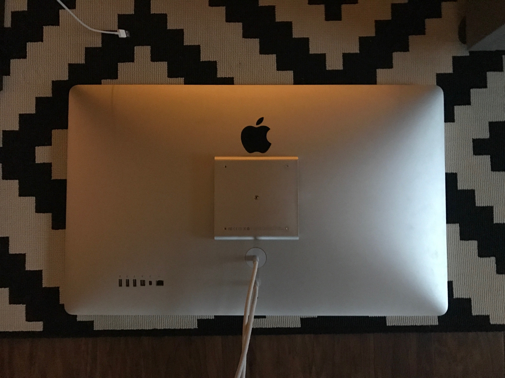
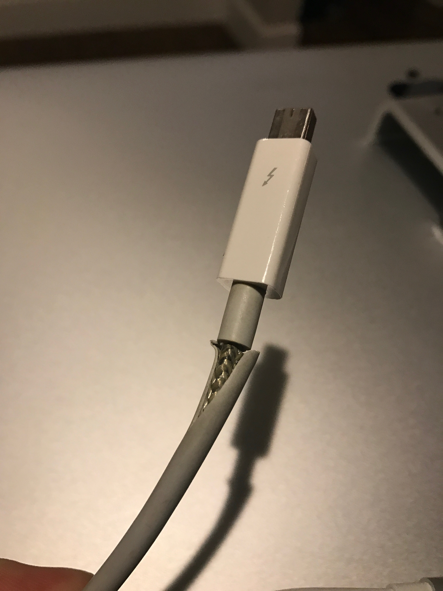
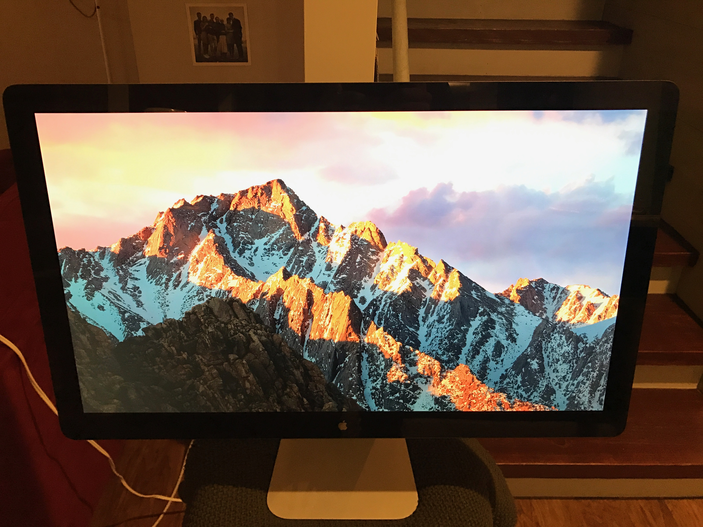
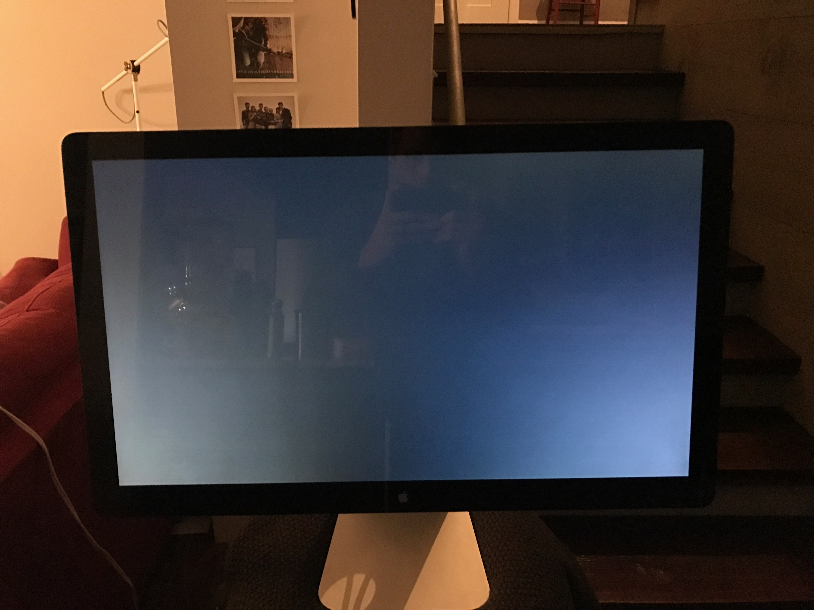

Apple Thunderbolt Display in original packaging.

There's one dead pixel in the right-center part of the screen. Hard to notice
unless you're looking for it.

I have the MagSafe 2 adaptor, so it works with new and old MacBooks, but I've
been having some issues with it where it will power my MacBook, but not charge
it. Not sure if it's the MacBook or the Display, but feel free to bring your
MacBook by to try it out before buying. It doesn't effect the functionality of
the display besides needing to use the power cord that came with your laptop.

Here's the Apple description:

> 27-inch (diagonal viewable image size) thin film transistor (TFT)
> active-matrix liquid crystal display (LCD) with in-plane switching (IPS).
>
> Cables:  
> Built-in Thunderbolt cable  
> Built-in MagSafe cable (up to 85W)
>
> Peripheral connections:  
> Three powered USB 2.0 ports  
> FireWire 800 port  
> Gigabit Ethernet port  
> Thunderbolt port  
> Kensington security slot
>
> Specs:  
> Resolution: 2560 by 1440 pixels  
> Colors (maximum): 16.7 million  
> Aspect ratio: 16:9  
> Viewing angle: 178° horizontal; 178° vertical  
> Brightness: 375 cd/m2  
> Contrast ratio: 1000:1  
> Response time: 12 ms  
> Height: 19.35 inches (49.1 cm)  
> Width: 25.7 inches (65 cm)  
> Depth (with stand): 8.15 inches (20.7 cm)  
> Weight: 23.5 pounds (10.8 kg)
>
> Built-in FaceTime HD camera with microphone  
> Built-in 2.1 speaker system (49 watts)

